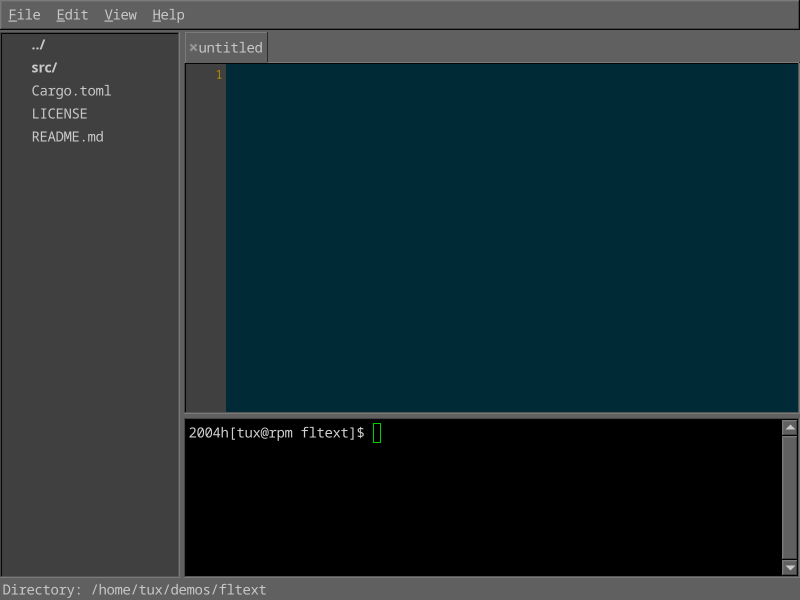

# red

red or the RustyEditor is a lightweight and minimal text editor which supports multiple-tabs (à la vscode) and which integrates a file browser and a terminal. The editor component supports syntax highlighting via [tree-sitter-highlight](https://github.com/tree-sitter/tree-sitter/tree/master/highlight).



## Building
```bash
git clone https://github.com/MoAlyousef/red
cd red
cargo build --release
```

To disable building with tree-sitter and the terminal:
```bash
cargo build --no-default-features --release
```

To build with native wayland support on Linux:
```bash
cargo build --features=fltk/use-wayland --release
```


## Known issues
- If you're running KDE and no icons appear in the FileBrowser, you can try setting the KDEDIR to /usr/local.
- Highlighting via tree-sitter seems to vary between different language modules. tree-sitter-json seems quite limited for example.

## ToDo
- Add a settings dialog.
- Save and get user settings using fltk [Preferences](https://docs.rs/fltk/latest/fltk/app/prefs/struct.Preferences.html).
- Enable using FLTK's FileChooser instead of the system provided one via the settings.
- Add more options to FileBrowser popup menu and the terminal menu.
- Support user provided color schemes for the app and the highlighting.
- Support regex for search & replace.
